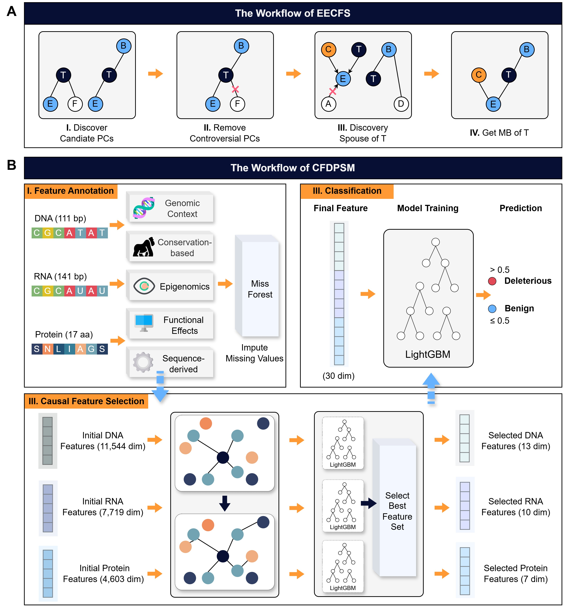

# EECFS: Efficient Ensemble Causal Feature Selection



## 1 EECFS

In this section, we introduce the EECFS algorithm.

> During the spouse discovery phase, the EDMB algorithm identifies the PC set of each variable in the target's PC as candidate spouses. However, spouse nodes only exist in the PC sets of certain children, which causes EDMB to perform many unnecessary conditional independence (CI) tests across all parents and children. This increases computational overhead. To address this issue, EECFS directly selects spouse candidates from the PC sets of target children that have multiple parents. This strategy significantly reduces the number of CI tests and improves computational efficiency.

## 2 CFDPSM

CFDPSM consists of three sequential modules:

1. Feature Annotation

Features are extracted from DNA, RNA, and protein levels to annotate each variant.
Features with a missing value ratio ≤ 5% are retained. Missing values are imputed using the MissForest algorithm.

2. Causal Feature Selection

For the raw feature set, multiple causal feature selection methods are applied independently to identify their corresponding Markov Blanket (MB) sets.
From the extracted MB candidates, the subset with the lowest dimensionality that achieves optimal or near-optimal performance on the training set is selected as the final feature subset.

3. Classification

The MB feature subsets from the three molecular levels are concatenated to form the final feature set.
LightGBM is then used for model training and prediction. Variants are classified as:
- Pathogenic if predicted score > 0.5
- Benign if predicted score ≤ 0.5

## 3 Directory Structure

NOTE: Datasets are available at FigShare:
DOI: `10.6084/m9.figshare.31566328`

- 📂 code/ — Main Code Directory

```
code/
│
├── Causal_feature_selection/
│   │
│   ├── alg_MB/
│   │   Other competing causal feature selection methods
│   │   _G2 suffix → G² test
│   │   _Z suffix → Fisher Z test
│   │
│   ├── common/
│   │   General MATLAB function files
│   │
│   ├── evaluation/
│   │   MATLAB evaluation scripts
│   │
│   ├── example_MB.m
│   │   Demonstrates Markov Blanket learning
│   │
│   ├── Causal_Learner.m
│   │   Unified interface for causal structure and MB learning
│   │
│   └── extract_MB.py
│       Extracts MB feature data
│
├── 5fold_lightgbm.py
│   Performs 5-fold training using best parameters
│
├── call_5fold_lightgbm.py
│   Calls 5fold_lightgbm.py
│
└── lightgbm_test.py
    Evaluates the final model
```


- 📂 data/ — Training and Evaluation Data

```
data/
│
├── DNA/
│   DNA-level feature space
│   train_ / test_ prefixes indicate datasets
│   Missing values imputed via MissForest
│
├── RNA/
│   Same structure as DNA
│
├── Protein/
│   Same structure as DNA
│
├── MB_feature/
│   MB feature sets from different causal methods
│
├── Benchmark_NB_dataset/
│   Benchmark Bayesian network datasets
│
│   ├── Real_world_dataset/
│   │
│   ├── make_data.m
│   │   Generates 10-fold CV index
│   │
│   └── n_XXXX/
│       n → dataset number
│       XXXX → dataset name
│
└── model/
    Final trained model weights of CFDPSM
```

## 4 Reproducibility Guide

### 4.1 Reproduce Results on Benchmark BN Networks

Run and evaluate causal feature selection methods
In this task, identifying the true MB set is used as the evaluation objective, and F1-score is reported.
- Run: `./code/Causal_feature_selection/example_MB.m` (Optional parameters are documented `at the top of the script`.)
- Specify parameters:
    - data_index
    - data_name
    - data_samples
    - alg_name

- Output: ./result/Benchmark_NB_dataset/

- Generated files: {alg_name}\_metrics\_{data\_name}.txt

- This file contains:
    - MB discovery performance
    - Number of CI tests
    - Runtime (seconds)

### 4.2 Reproduce Results on Real-World Networks

- Run: `./code/Causal_feature_selection/main_MB.m`
- Specify parameters:
    - data_index
    - data_name
    - alg_name

- Outputs: `./result/Real_world_dataset/`

- Generated files:
    - {alg_name}\_MB\_{data_name}.txt
    - {alg_name}\_metrics\_{data_name}.txt

- These contain:
    - Identified MB sets
    - Prediction performance (KNN and SVM)
    - Number of CI tests
    - Runtime (seconds)

## 4.3 Reproduce Results for DNA, RNA, and Protein Levels

1. Run causal feature selection

- Run: `./code/Causal_feature_selection/test_Real_MB.m`
    - Modify:
        - data_name
        - alg_name

2. Extract MB feature indices

- Run: `./code/Causal_feature_selection/extract_MB.py`
    - Modify:
        - molecular_type
        - alg_name

3. Evaluate prediction performance
- Run: `./code/Molecular_evaluation/00-pipeline.py`
    - Modify:
        - molecular_type
        - alg_name

- Evaluation metrics:
    - AUC
    - AUPR
    - 5-fold cross-validation mean results

- Output file: `./result/{molecular_type}/{alg_name}_CV_results.csv`

### 4.4 Reproduce sSNVs Prediction Results

- Run: `./code/CFDPSM/run_cfdpsm.py`


## 5 Use CFDPSM to inference other sSNVs


### 5.1 Feature annotation

1. Annotate SynMall features

```shell
python ./code/CFDPSM/AnnoSynMall.py
```

2. Annotate MMSplice features

```shell
conda activate mmsplice
bash AnnoMMSplice.sh \
    ${YOUR_VCF_INPUT} \
    hg38 \
    ${YOUR_TASK_DIR}
```

3. Retrieve sequence

The `bedtools` is needed to download first.

```shell
python Get_DNA_Sequence.py
python Get_RNA_Sequence.py
python Get_Protein_Sequence.py
```

4. Annotate ifeatureOmega

```shell
conda activate ifeatureOmega
cd {YOUR_INSTALL_PATH}/iFeatureOmega-CLI-main/
# cp ./get_iFeatureOmega_EECFS.py {YOUR_INSTALL_PATH}/iFeatureOmega-CLI-main/ 
./Anno_iFeatureOmega.sh
```

5. Annotate MathFeature

```shell
conda activate mathfeature
./AnnoMathFeature.sh
```

6. Annotate ftrCOOL

```shell
conda activate R
Rscript ftrCOOL_RNA_EECFS.R
# reformat
python Filter_features_ftrCOOL.py \
--fasta_file ${YOUR_INPUT_DIR}/ref_sequences_rna.fasta \
--ref_fea ${YOUR_OUTPUT_DIR}/ExpectedValKmerNUC_RNA_ref.xlsx \
--alt_fea ${YOUR_OUTPUT_DIR}/ExpectedValKmerNUC_RNA_alt.xlsx \
--output_file ${YOUR_OUTPUT_DIR}/ftrCOOL.csv
```

7. Concatenate the features

```shell
python Concatenate_result.py
```

8. Impute the missing values

```shell
conda activate R
Rscript ./code/Preprocess/MissForest.R
```

## 5.2 Inference

```shell
python inference.py
```

## 6 Citation Information

### 6.1 Causal Learner Package

Other MB methods in this repository (except EDMB) are provided via the Causal Learner package:

http://bigdata.ahu.edu.cn/causal-learner

Please cite:
```bibtex
@article{ling2022causal,
  title={Causal learner: A toolbox for causal structure and markov blanket learning},
  author={Ling, Zhaolong and Yu, Kui and Zhang, Yiwen and Liu, Lin and Li, Jiuyong},
  journal={Pattern Recognition Letters},
  volume={163},
  pages={92--95},
  year={2022},
  publisher={Elsevier}
}
```

### 6.2 EECFS
```bibtex
In preparation.
```